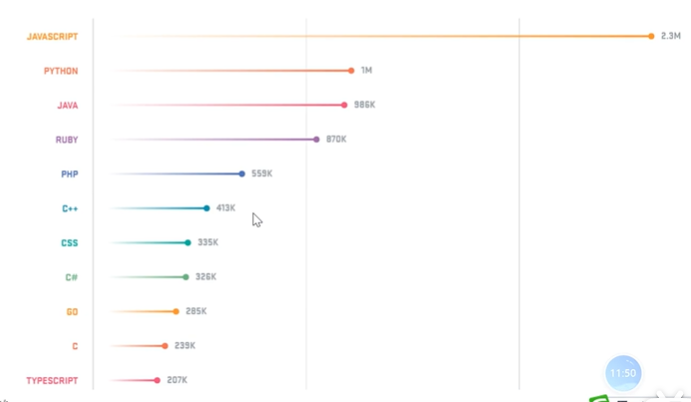
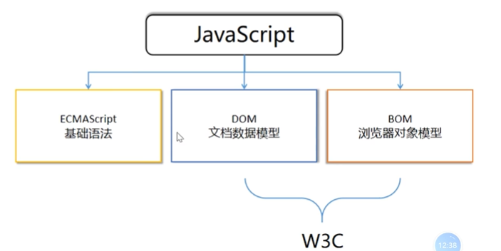
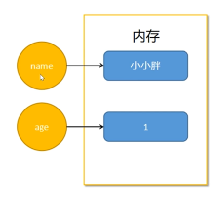
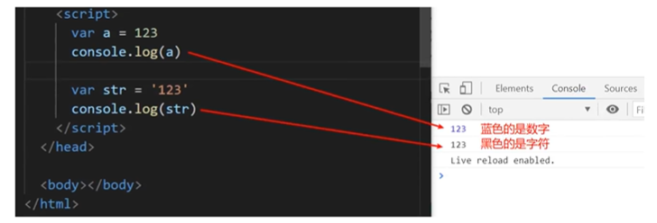

# 一. JavaScript简介

## 1.JavaScript的发展历程

回顾整个JavaScript的发展历程，实际上就是Web发展的历程

从最开始的拨号上网方式到现在的100M光纤，4G/5G移动Web的发展

在近20年，上网方式发生了翻天覆地的变化，可以是科技大爆炸

人们在享受越来越多便捷的上网的同时，对Web产品的需求越来越高

从单纯的对访问速度的需求，越来越多的转移到视觉美感，智能操作交互，沉浸式虚拟现实，这些需求又反过来推动了技术的不断创新与进步

### 01）JavaScript的诞生

在互联网初期(20世纪90年代)----**web1.0**

主要通过拨号上网的方式浏览网页，提交信息，上网的速度只有28.8kbit/s

JavaScript最初是网景公司的工程师`Brandan Eich`花了10天的时间设计出来的，主要是为了在浏览器上验证用户输入的信息是否符合格式

> 为什么要这样做呢？

因为当时的网络是非常慢的，如果用户填写了大量的信息，提交到服务器，在服务器端验证发现不合格，用互需要再次重新填写，这个是很让人抓狂的

设想一下，用户提完一个表单，点击提交按钮，等待了30秒的处理后，看到的却是一条告诉你忘记填写一个必要的字段

最开始的时候，`Eich`把自己设计的这种运行在浏览器上的脚本叫做`LiveScript`在发布的时候为了蹭Java的热度，就改名叫作`JavaScript`,实际上跟Java没有半毛钱关系

### 02）JavaScript的成长

在PC互联网(2010年之前)----**web2.0**

这个时候，个人电脑PC开始普及，网络速度突飞猛进，上网的成本越来越低

人们开始大量的使用PC访问web应用，包括：

- blog(博客)--新浪
- RSS(订阅)
- 社交网络(SNS)--FaceBook/人人网
- P2P(下载)--迅雷
- 搜索引擎--Google/baidu
- 即时通讯(IM)--QQ
- 电子商务--Taobao

在这个时代，JavaScript都只是一种不起眼的小脚本，没有人把他当成真正的编程语言

JavaScript这这个时候依然只是用来处理PC网页的简单动画和验证，也没有单独的前端岗位，大部分前端的工作都是由php程序员或者UI人员完成的

### 03）JavaScript的新生

> web3.0

随着乔帮主推出的iPhone智能手机，改变了人们的生活方式

以智能手机为代表的移动互联网应运而生，称为**web3.0**

> HTML5与CSS3

到2015年左右，HTML5与CSS3的标准化，大大推进了前端的发展

前端做为一个独立的方向真正开始被重视

> ECMA2015

在2015年，JavaScript的规范组织ECMA(欧洲计算机制造商协会)推出了ECMA2015,也被称为ES6

这一版本的出现，极大的改进了JavaScript语言，使得JavaScript具备开发大型项目的能力

> V8引擎与Node.js

chrome推出的V8引擎将JavaScript的速度提升了几个数量级

Node.js的出现，完善了JavaScript在服务端的能力，使得JavaScript编写服务端程序作为可能

> 未来的发展

自2016年以来，前端的发展非常迅猛，开源社区越来越活跃，出现了大量的工作岗位。薪水也水涨船高，JavaScript现在应用的范围越来越广

- 微信小程序
- H5游戏
- 桌面应用(Electron)
- webApp
- AI+物联网(Alot)



## 2. JavaScript组成

一般认为 JavaScript由三部分组成

- ECMAScript：基本语法
- DOM：文档数据模型
- BOM：浏览器对象模型



### 01）ECMAScript

ECMAScript是由ECMA(原欧洲计算机制造商协会)进行标准化的一门编程语言，主要规定了像变量，数据类型，流程控制，函数等基础语法

### 02）DOM和BOM

W3C：**万维网联盟**(World Wide Web Consortium)主要是完成HTML和CSS及浏览器标准化的研究，是一个非盈利性的公益组织，主要由大公司和开发人员组成

其中，

- DOM是由W3C组织制定的标准，通过DOM提供的接口可以对页面上的各种元素进行操作(大小、位置、颜色、事件等)
- BOM是由各个浏览器厂商根据DOM在各自浏览器上的实现，不同的浏览器会略有差异，通过BOM可以操作浏览器窗口，比如弹出框、控制浏览器跳转、获取分辨率等

### 03）JavaScript写在哪里

跟CSS一样，JavaScript也有3种书写方式

- 外部：将JavaScript文件单独保存，再通过`<script src="xxx.js">`引入

- 内嵌：在HTML文件中，将JavaScript代码写在`<script></script>`标签中

- 行内：现在几乎不用

> 示例

外部

```
 <script src="js/my.js"></script>
```

内嵌

```
<script>
	console.log("内部")
</script>  
```

在实际工作中，通常将JavaScript代码写在文件中，再使用外部方式引入

### 04）体验JavaScript

为了方便信息的输入输出，JavaScript提供了一些输入输出的语句，其常用的语句如下：

| 方法             | 说明                           | 归属      |
| ---------------- | ------------------------------ | --------- |
| alert(msg)       | 浏览器弹出警示框               | 浏览器BOM |
| console.log(msg) | 浏览器控制台打印输出信息       | 浏览器BOM |
| prompt(info)     | 浏览器弹出输入框，用户可以输入 | 浏览器BOM |

- 注意：alert()主要是用来显示消息给用户，console.log()用来给程序员自己看运行时的消息

> 示例

```
<!DOCTYPE html>
<html lang="en">
<head>
    <meta charset="UTF-8">
    <meta http-equiv="X-UA-Compatible" content="IE=edge">
    <meta name="viewport" content="width=device-width, initial-scale=1.0">
    <title>js书写位置</title>
    <!-- 外部引入 -->
    <script src="js/my.js"></script>
</head>
<body>
    <!-- 内部：建议大家放在body的最后 -->
    <script>
        console.log("内部")
        // 用户输入的内容会被保存到username变量中
        var username = prompt("请输入用户名");
        console.log(username)
    </script>  
</body>
</html>
```

# 二.变量

## 1.什么是变量

变量是一个存放数据的容器(盒子)，由**变量名**和**变量值**组成

就好比，通过**房间号(变量名)**可以找到**某个人(变量值)**



> 拓展

变量是程序在内存中申请的一块用来存放数据的空间

## 2.变量的使用

### 01）变量的声明

> 语法

```
// 1. 声明变量： var 变量名
var uname;
var age;
```

- var (variable)是一个JavaScript关键字，用来声明变量，后面跟变量名

- uname/age就是变量名，计算机通过这个名字就可以找到对应的内存空间，进而访问到空间里的数据

### 02）变量的赋值

> 语法

```
// 变量名 = 变量值
age = 18;  //将数值10放到age对应的空间
```

### 03）声明的同时赋值

> 示例

```
var age = 18
```

变量可以重新赋值，新值会覆盖旧值

```
age = 25
```

> 注意

一般，变量先声明再使用

## 3.变量命名规则

在JavaScript中，变量的命名有一定的规则的

- 标识符：由字母(A-Za-z)、数字(0-9)、下划线(_)、美元符号($)组成
- 变量名**严格区分大小写**，如app和APP是不同的变量
- **不能**以数字开头
- **不能**是`关键字`或者`保留字`

推荐使用驼峰法(首字母小写，后面单词的首字母需要大写)

如：`myName`

## 4.关键字与保留字

| abstracr | arguments | boolean    | break     | byet         |
| -------- | --------- | ---------- | --------- | ------------ |
| case     | catch     | char       | class*    | const        |
| continue | debugger  | default    | delete    | do           |
| double   | else      | enum*      | eval      | export*      |
| extends* | false     | final      | finally   | float        |
| for      | function  | goto       | if        | implements   |
| import*  | in        | instanceof | int       | interface    |
| let      | long      | native     | new       | null         |
| package  | private   | protected  | public    | return       |
| short    | static    | super*     | switch    | synchronized |
| this     | throw     | throws     | transient | true         |
| try      | typeof    | var        | void      | volatile     |
| while    | witch     | yield      |           |              |

*标记的关键字是ECMAScript5中新添加的

更多相关内容，参考 [JavaScript保留关键字](https://www.runoob.com/js/js-reserved.html)

# 三.数据类型

## 1.什么是数据类型

> 现实

描述不同的数据时，人们往往会使用不同的类型，比如：

- 姓名：字符

- 年龄：数字

- 一个命题的结论：真假

> 程序

在程序中，不同类型的数据在存储和传输中占用空间的大小是不同的，因此，会存在数据类型的区别

> 变量的数据类型

变量的数据类型就是在变量中保存的数据的类型

> 示例

```
var uname = "test";  //uname变量的数据类型就是字符串
var age = 18;  //age变量的数据类型就是数字型
```

JavaScript是弱类型语言，并没有严格的规定变量的类型，换句话说，变量的类型是可以改变的，但是强烈不建议这么做

*不推荐*

```
var age = 1;   //初始类型是数字型
age = "你好";  //age现在是字符型
```

## 2.常用的数据类型

### 01）简单的数据类型

- Number:数字型
- String:字符型
- Boolean: 布尔型
- Undefined:未定义
- Null:空

| 简单数据类型 | 说明                                | 默认值     |
| ------------ | ----------------------------------- | ---------- |
| Number       | 数字型，包含整数和小数，如21，0.1   | 0          |
| String       | 字符型，如'张三'，字符型带引号      | ''(空字符) |
| Boolean      | 布尔型，如true、false；等价于1和0   | false      |
| Undefined    | 未定义，变量声明未赋值就是undefined | undefined  |
| Null         | 空                                  | null       |

**数字型**

> 示例

```
var num = 10;  // num 数字型
var PI = 3.14;  // PI 数字型
var hex = 0xff;  // 16进制

var nan = "字符串" - 100;
console.log(nan)  // NaN(Not a Number)

console.log(Number.MAX_VALUE) //数字型的最大值
console.log(Number.MIN_VALUE) //数字型的最小值
console.log(Number.MAX_VALUE * 2) //Infinity 无穷大
console.log(-Number.MAX_VALUE * 2) //-Infinity 无穷小
```

这里注意一种特殊的数：NaN(Not a Number)非数

**字符型**

使用**引号**来表示一个字符串

- 单引号，双引号都可以，推荐使用单引号，HTML中一般使用双引号
- 引号成对使用

> 示例

```
var str = '我是一个"美女"程序媛';
console.log(str);
// 字符串转义字符 都是用\开头 但是这些转义字符写到引号里面
var str1 = "我是一个'美女'程序媛";
console.log(str1);
```

转义字符

| 转义符 | 解释说明                 |
| ------ | ------------------------ |
| \n     | 换行符，n是newline的意思 |
| \\     | 斜杆 \                   |
| \ '    | ' 单引号                 |
| \ "    | " 双引号                 |
| \t     | tab缩进                  |
| \b     | 空格， b是blank的意思    |

> 字符串拼接

在JavaScript中，+是一个很特别的符号，可以用域字符串拼接

```
var str = 'hello' + ' world'
console.log(str)  // hello world
```

```
var hello = 'hello';
var world = ' world';
var str = hello + world;
console.log(str) 
```

```
var str = '10' + '20';
console.log(str) // 1020
```

> 小技巧

在Chrome调试控制台中

- 蓝色：数字
- 黑色：字符

> 示例



**布尔型**

布尔类型有两个值： true和false，其中

- true 表示真
- false 表示假

```
console.log(true);  //true
console.log(false);  //false
```

**Undefined**

一个变量声明了，但是没有被赋值，这时变量里会使用默认值undefined

**Null**

空，在讲对象的时候再讲

### 02）引用的数据类型

- Object：对象

关于引用数据类型是相对比较难的问题，在后面的章节，我们会专门来讲解

这里，有一句名言，大家可以先记下来，后面慢慢体会

> 在JavaScript中，一切都是对象

## 3.如何判断数据类型

通过`typeof`可用来获取检测变量的数据类型

> 示例

```
var num = 18;
console.log(typeof num)  //number
```

## 4.数据类型转换

### 01）显式转换

最常见的是字符串转数值型

> 需求

1. 先弹出第一个输入框，提示用户输入第一个值，保存起来
2. 再弹出第二个框，提示用户输入第二个值，保存起来
3. 把这两个值相加，并讲结果赋值给新的变量
4. 弹出警告框(alert)，把计算的结果输出

> 示例

```javascript
var num1 = prompt("请输入第一个值");
var num2 = prompt("请输入第二个值");
var result = num1 + num2;
alert(result)
```

我们发现prompt返回的类型时字符串，两个字符串相加，其实就是拼装，并不是我们想要的结果，这时我们需要先将字符型转换成数字型，再运算

```javascript
var num1 = parseInt(prompt("请输入第一个值"));
var num2 = parseInt(prompt("请输入第二个值"));
var result = num1 + num2;
alert(result)
```

- parseInt的作用是将字符转换为整数

更多转换函数，参考手册：[JavaScript类型转换](https://www.w3school.com.cn/js/js_type_conversion.asp)

### 02）隐式转换

> 什么是隐式转换

隐式转换就是JavaScript引擎偷偷将类型转换了，不让你知道

由于JavaScript是一种非常灵活的语言，导致数据类型存在大量隐式转换，这里面有很多坑

我不打算在这里细讲，这对初学者来说是个灾难，但是一些技术面试题又特别喜欢扣这些细节

因此，我们先知道这里有坑，再后续的面试准备课时，我们会做一个专题专门来针对性练习

这些问题，说实话，在真实的工作中遇到的概率极低，但是在面试中(尤其是笔试)中考查的很多，不得不吐槽一下天朝面试

> 面试造航母，上班拧螺丝

通过几个例子，大家先理解一些常用的

> 示例

`+` 隐式转换

```
// 只要+号的一边是字符，最终的结果就是字符
console.log('123'+'456') //'123456'
console.log('123'+456) //'123456'
console.log('123'+true) //'123true'

//特殊
undefined+1 //NaN
```

`==` 的隐式转换

大体的原则是

- 字符型 转换成 数字型
- 布尔型 转换成 数字型

> 示例

```
'1' == 1 //true
true == 1 //true
'1' == true //true

//特殊的
NaN != NaN //true
undefined == null //true
```

关于Boolean类型的转换

**空字符串(''), NaN, 0, null, undefined**=>false

其余的全部=>true

# 四.运算符

## 1.运算符的分类
