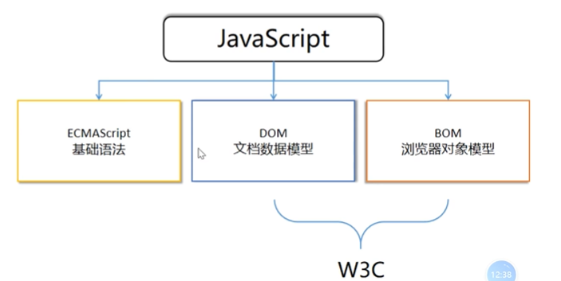
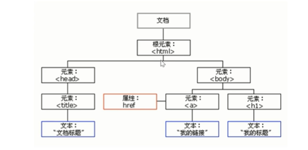
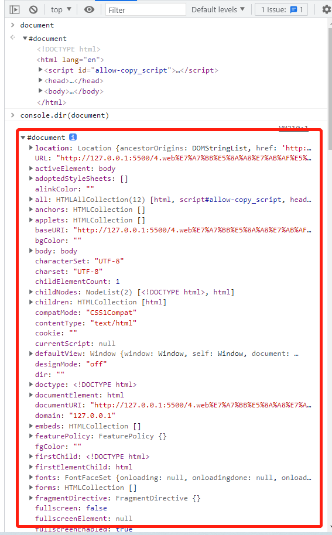

# 一.DOM介绍

一般认为JavaScript由三个部分组成

- ECMAScript：基础语法
- DOM：文档数据模型
- BOM：浏览器对象模型



通过前面的学习，我们了解ECMAScript，也就是JavaScript的基础语法部分，从这一讲开始，我们来简单的了解一下DOM和BOM

## 1.什么是DOM

>DOM(Document Object Model)文档对象模型

DOM是W3C组织制定并推荐的标准，这个标准提供了一系列操作HTML的统一API

核心对象是`document`

HTML是一种标记语言，那么浏览器是如何解析并渲染显示的呢？

> 浏览器的工作流程

1. 浏览器读取HTML文件
2. 在内存中生成DOM树
3. 调用API渲染显示

## 2.DOM树



`DOM树`是将HTML文档映射成树形结构，通过**节点对象**对其处理，处理的结果可以加入到当前的页面

- 文档：一个HTML页面就是一个文档，DOM中使用document表示

- 节点：网页中的所有内容，在DOM树中都是一个节点(标签、属性、文本、注释等)

  * 元素节点：网页中的所有内容，比如h1、div都是一个元素，也就是element Node

  * 文本节点：<h1>文本</h1> 里的文本就是文本节点，也就是text Node

  * 属性节点：</img> 里的属性就是属性节点



## 3.获取元素

如果要操作DOM,首先我们需要知道具体需要操作哪一个元素，即：获取元素

目前最常用的API

- getElementById(兼容性好)
- querySelect(H5新增，功能强大)
- querySelectAll(H5新增)

> 示例一

```
<!DOCTYPE html>
<html lang="en">
<head>
    <meta charset="UTF-8">
    <meta http-equiv="X-UA-Compatible" content="IE=edge">
    <meta name="viewport" content="width=device-width, initial-scale=1.0">
    <title>H5新增获取DOM方法</title>
</head>
<body>
    <div class="box">盒子1</div>
    <div class="box">盒子2</div>

    <div id="nav">
        <ul>
            <li>首页</li>
            <li>产品</li>
            <li>联系我们</li>
        </ul>
    </div>

    <script>
        var firstBox = document.querySelector(".box");
        console.log(firstBox)

        var navBox = document.querySelector("#nav");
        console.log(navBox)

        var liBox = document.querySelector("li");
        console.log(liBox)

        var allBox = document.querySelectorAll(".box");
        console.log(allBox)
    </script>
</body>
</html>
```


## 4.事件驱动

### 01）什么是事件驱动

我们说JavaScript采用的是事件驱动机制，即：**触发-响应机制**

> 如何理解

触发一个特定的事件，比如：点击一个按钮，然后会执行事件对应的函数

> 示例

```
<!DOCTYPE html>
<html lang="en">
<head>
    <meta charset="UTF-8">
    <meta http-equiv="X-UA-Compatible" content="IE=edge">
    <meta name="viewport" content="width=device-width, initial-scale=1.0">
    <title>事件驱动</title>
</head>
<body>
    <button id="btn">点击</button>
    <script>
        var btn = document.getElementById("btn");
        btn.onclick = function() {
            alert("点击了");
        }
    </script>
</body>
</html>
```

步骤

1. 获取元素
2. 注册事件(绑定事件)处理函数
3. 触发事件，执行函数

### 02）鼠标事件

| 事件名      | 触发条件 |
| ----------- | -------- |
| onclick     | 鼠标点击 |
| onblur      | 失去焦点 |
| onfocus     | 获取焦点 |
| onmouseover | 鼠标经过 |

> 示例-仿淘宝隐藏二维码

点击x号，隐藏广告

```
<!DOCTYPE html>
<html lang="en">
<head>
    <meta charset="UTF-8">
    <meta http-equiv="X-UA-Compatible" content="IE=edge">
    <meta name="viewport" content="width=device-width, initial-scale=1.0">
    <title>仿淘宝二维码</title>
    <style type="text/css">
        .box {
            display: flex;
            align-items: center;
            justify-content: center;
            flex-direction: column;
            width: 70px;
            height: 120px;
            background-color: #ccc;
            padding: 10px;
        }
        .box img {
            width: 96%;
        }
    </style>
</head>
<body>
    <div class="box">
        <p>去领红包</p>
        
        <i class="close_btn">x</i>
    </div>
    <script>
        var closeBtn = document.querySelector(".close_btn");
        var box = document.querySelector(".box");
        closeBtn.onclick = function() {
            box.style.display = "none";
        }
    </script>
</body>
</html>
```

> 示例-仿京东输入框

文本框获取焦点时，文字颜色变浅，文本框的内容清空

文本框失去焦点时，颜色恢复，文本框为空时，提示内容

```
<!DOCTYPE html>
<html lang="en">
<head>
    <meta charset="UTF-8">
    <meta http-equiv="X-UA-Compatible" content="IE=edge">
    <meta name="viewport" content="width=device-width, initial-scale=1.0">
    <title>仿京东输入框</title>
    <style>
        .box input {
            line-height: 36px;
            padding: 0 10px;
            color: #999;
        }
        .box .search {
            height: 38px;
            vertical-align: middle;
        }
    </style>
</head>
<body>
    <div class="box">
        <input type="text" value="婴幼儿奶粉" placeholder="请输入内容">
        <button class="search">搜索</button>
    </div> 
    <script>
        var inp = document.querySelector("input");
        var search = document.querySelector(".search");

        inp.onfocus = function() {
            inp.style.color = "#333";
            if(inp.value == "婴幼儿奶粉") {
                inp.value = "";
            }
        }

        inp.onblur = function() {
            inp.style.color = "#999";
            if(inp.value.length == 0) {
                inp.value = "婴幼儿奶粉";
            }
        }
    </script>
</body>
</html>
```


### 03）键盘事件

| 事件名     | 触发条件                                               |
| ---------- | ------------------------------------------------------ |
| onkeyup    | 按键松开时触发                                         |
| onkeydown  | 按键按下时触发                                         |
| onkeypress | 按键按下时触发，不能识别ctrl,shift等功能键，区分大小写 |


### 04）新增的事件注册方式

addEventListener()

> 示例

```
domObj.addEventListener("click",function(){
	alert(22)
})
```

- 在注册事件时不用加**on**

### 05）事件对象

> 示例

```
domObj.addEventListener("click",function(e){
	console.dir(e)
})
```

比较常用的属性和方法

- e.target：触发事件的对象
- e.preventDefult()：阻止默认行为
- e.stopPropagation()：阻止冒泡

> 示例-判断哪个按键被按下了

```
<!DOCTYPE html>
<html lang="en">
<head>
    <meta charset="UTF-8">
    <meta http-equiv="X-UA-Compatible" content="IE=edge">
    <meta name="viewport" content="width=device-width, initial-scale=1.0">
    <title>事件对象</title>
</head>
<body>
    <script>
        document.addEventListener("keyup", function(e) {
            if(e.keyCode == 65) {
                console.log("按下了a键")
            }else {
                console.log(e.keyCode)
            }
        })

        document.addEventListener("keypress", function(e) {
            if(e.keyCode == 65) {
                console.log("按下了A键")
            } else if(e.keyCode == 97){
                console.log("按下了a键")
            } else {
                console.log(e.keyCode)
            }
        })
    </script>
</body>
</html>
```


## 5.自学API

# 二.BOM介绍

## 1.什么是BOM

## 2.常用方法

## 3.定时器

### 01）setTimeout

### 02）setInterval

### 02）clearInterval

## 4.location对象

