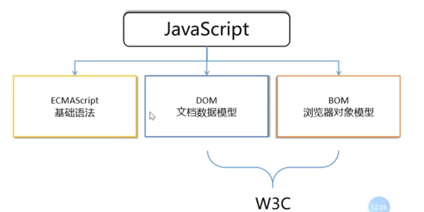
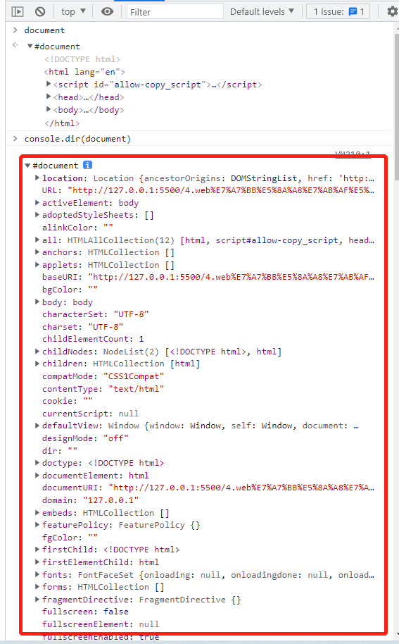
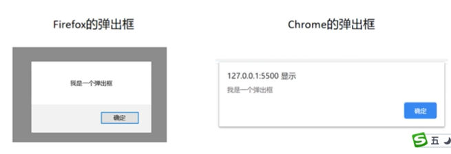

# 一.DOM介绍

一般认为JavaScript由三个部分组成

- ECMAScript：基础语法
- DOM：文档数据模型
- BOM：浏览器对象模型



通过前面的学习，我们了解ECMAScript，也就是JavaScript的基础语法部分，从这一讲开始，我们来简单的了解一下DOM和BOM

## 1.什么是DOM

>DOM(Document Object Model)文档对象模型

DOM是W3C组织制定并推荐的标准，这个标准提供了一系列操作HTML的统一API

核心对象是`document`

HTML是一种标记语言，那么浏览器是如何解析并渲染显示的呢？

> 浏览器的工作流程

1. 浏览器读取HTML文件
2. 在内存中生成DOM树
3. 调用API渲染显示

## 2.DOM树


`DOM树`是将HTML文档映射成树形结构，通过**节点对象**对其处理，处理的结果可以加入到当前的页面

- 文档：一个HTML页面就是一个文档，DOM中使用document表示

- 节点：网页中的所有内容，在DOM树中都是一个节点(标签、属性、文本、注释等)

  * 元素节点：网页中的所有内容，比如h1、div都是一个元素，也就是element Node

  * 文本节点：<h1>文本</h1> 里的文本就是文本节点，也就是text Node

  * 属性节点：</img> 里的属性就是属性节点



## 3.获取元素

如果要操作DOM,首先我们需要知道具体需要操作哪一个元素，即：获取元素

目前最常用的API

- getElementById(兼容性好)
- querySelect(H5新增，功能强大)
- querySelectAll(H5新增)

> 示例一

```
<!DOCTYPE html>
<html lang="en">
<head>
    <meta charset="UTF-8">
    <meta http-equiv="X-UA-Compatible" content="IE=edge">
    <meta name="viewport" content="width=device-width, initial-scale=1.0">
    <title>H5新增获取DOM方法</title>
</head>
<body>
    <div class="box">盒子1</div>
    <div class="box">盒子2</div>

    <div id="nav">
        <ul>
            <li>首页</li>
            <li>产品</li>
            <li>联系我们</li>
        </ul>
    </div>

    <script>
        var firstBox = document.querySelector(".box");
        console.log(firstBox)

        var navBox = document.querySelector("#nav");
        console.log(navBox)

        var liBox = document.querySelector("li");
        console.log(liBox)

        var allBox = document.querySelectorAll(".box");
        console.log(allBox)
    </script>
</body>
</html>
```


## 4.事件驱动

### 01）什么是事件驱动

我们说JavaScript采用的是事件驱动机制，即：**触发-响应机制**

> 如何理解

触发一个特定的事件，比如：点击一个按钮，然后会执行事件对应的函数

> 示例

```
<!DOCTYPE html>
<html lang="en">
<head>
    <meta charset="UTF-8">
    <meta http-equiv="X-UA-Compatible" content="IE=edge">
    <meta name="viewport" content="width=device-width, initial-scale=1.0">
    <title>事件驱动</title>
</head>
<body>
    <button id="btn">点击</button>
    <script>
        var btn = document.getElementById("btn");
        btn.onclick = function() {
            alert("点击了");
        }
    </script>
</body>
</html>
```

步骤

1. 获取元素
2. 注册事件(绑定事件)处理函数
3. 触发事件，执行函数

### 02）鼠标事件

| 事件名      | 触发条件 |
| ----------- | -------- |
| onclick     | 鼠标点击 |
| onblur      | 失去焦点 |
| onfocus     | 获取焦点 |
| onmouseover | 鼠标经过 |

> 示例-仿淘宝隐藏二维码

点击x号，隐藏广告

```
<!DOCTYPE html>
<html lang="en">
<head>
    <meta charset="UTF-8">
    <meta http-equiv="X-UA-Compatible" content="IE=edge">
    <meta name="viewport" content="width=device-width, initial-scale=1.0">
    <title>仿淘宝二维码</title>
    <style type="text/css">
        .box {
            display: flex;
            align-items: center;
            justify-content: center;
            flex-direction: column;
            width: 70px;
            height: 120px;
            background-color: #ccc;
            padding: 10px;
        }
        .box img {
            width: 96%;
        }
    </style>
</head>
<body>
    <div class="box">
        <p>去领红包</p>
        
        <i class="close_btn">x</i>
    </div>
    <script>
        var closeBtn = document.querySelector(".close_btn");
        var box = document.querySelector(".box");
        closeBtn.onclick = function() {
            box.style.display = "none";
        }
    </script>
</body>
</html>
```

> 示例-仿京东输入框

文本框获取焦点时，文字颜色变浅，文本框的内容清空

文本框失去焦点时，颜色恢复，文本框为空时，提示内容

```
<!DOCTYPE html>
<html lang="en">
<head>
    <meta charset="UTF-8">
    <meta http-equiv="X-UA-Compatible" content="IE=edge">
    <meta name="viewport" content="width=device-width, initial-scale=1.0">
    <title>仿京东输入框</title>
    <style>
        .box input {
            line-height: 36px;
            padding: 0 10px;
            color: #999;
        }
        .box .search {
            height: 38px;
            vertical-align: middle;
        }
    </style>
</head>
<body>
    <div class="box">
        <input type="text" value="婴幼儿奶粉" placeholder="请输入内容">
        <button class="search">搜索</button>
    </div> 
    <script>
        var inp = document.querySelector("input");
        var search = document.querySelector(".search");

        inp.onfocus = function() {
            inp.style.color = "#333";
            if(inp.value == "婴幼儿奶粉") {
                inp.value = "";
            }
        }

        inp.onblur = function() {
            inp.style.color = "#999";
            if(inp.value.length == 0) {
                inp.value = "婴幼儿奶粉";
            }
        }
    </script>
</body>
</html>
```


### 03）键盘事件

| 事件名     | 触发条件                                               |
| ---------- | ------------------------------------------------------ |
| onkeyup    | 按键松开时触发                                         |
| onkeydown  | 按键按下时触发                                         |
| onkeypress | 按键按下时触发，不能识别ctrl,shift等功能键，区分大小写 |


### 04）新增的事件注册方式

addEventListener()

> 示例

```
domObj.addEventListener("click",function(){
	alert(22)
})
```

- 在注册事件时不用加**on**

### 05）事件对象

> 示例

```
domObj.addEventListener("click",function(e){
	console.dir(e)
})
```

比较常用的属性和方法

- e.target：触发事件的对象
- e.preventDefult()：阻止默认行为
- e.stopPropagation()：阻止冒泡

> 示例-判断哪个按键被按下了

```
<!DOCTYPE html>
<html lang="en">
<head>
    <meta charset="UTF-8">
    <meta http-equiv="X-UA-Compatible" content="IE=edge">
    <meta name="viewport" content="width=device-width, initial-scale=1.0">
    <title>事件对象</title>
</head>
<body>
    <script>
        document.addEventListener("keyup", function(e) {
            if(e.keyCode == 65) {
                console.log("按下了a键")
            }else {
                console.log(e.keyCode)
            }
        })

        document.addEventListener("keypress", function(e) {
            if(e.keyCode == 65) {
                console.log("按下了A键")
            } else if(e.keyCode == 97){
                console.log("按下了a键")
            } else {
                console.log(e.keyCode)
            }
        })
    </script>
</body>
</html>
```

> 示例

```
<!DOCTYPE html>
<html lang="en">
<head>
    <meta charset="UTF-8">
    <meta http-equiv="X-UA-Compatible" content="IE=edge">
    <meta name="viewport" content="width=device-width, initial-scale=1.0">
    <title>事件冒泡</title>
</head>
<body>
    <ul>
        <li id="li_1">1</li>
        <li>2</li>
        <li>3</li>
    </ul>

    <script>
        var _ul = document.querySelector("ul")
        _ul.addEventListener("click", function(e) {
            console.log(e)
            console.log(this)
            // 通过e.target得到具体操作的dom元素
            console.log(e.target)
        })

        li_1.addEventListener("click", function(e) {
            e.stopPropagation(); //阻止事件冒泡
        })
    </script>
</body>
</html>
```


## 5.自学API

1. 结点操作相关的API(增删改查)
2. 结点关系相关的API(父子兄弟)

> 练习：实现一个留言板

要求：

1. 当输入内容为空时。提示“请输入内容”
2. 每次发布的留言在最上面显示
3. 发布完后，清除之前写的内容

```
<!DOCTYPE html>
<html lang="en">
<head>
    <meta charset="UTF-8">
    <meta http-equiv="X-UA-Compatible" content="IE=edge">
    <meta name="viewport" content="width=device-width, initial-scale=1.0">
    <title>留言板</title>
    <style type="text/css">
        * {
            margin: 0;
            padding: 0;
        }
        body {
            padding: 100px;
        }
        textarea {
            width: 200px;
            height: 100px;
            border: 1px solid skyblue;
            resize: none;
            outline: none;
        }
        ul, li {
            list-style: none;
        }
        li {
            background-color: purple;
            line-height: 24px;
            margin-top: 10px;
            color:#fff;
        }
    </style>
</head>
<body>
    <textarea name="content" id="content" cols="30" rows="10"></textarea>
    <button id="btn">提交</button>
    <ul></ul>

    <script>
        var content = document.getElementById("content");
        var btn = document.getElementById("btn");
        var _ul = document.querySelector("ul");

        btn.addEventListener("click", function() {
            if(content.value == "") {
                alert("请输入内容")
                return
            }
            var _li = document.createElement("li");
            _li.innerHTML = content.value;
            _ul.insertBefore(_li, _ul.children[0]);
            content.value = "";
        })
    </script>
</body>
</html>
```


# 二.BOM介绍

## 1.什么是BOM

> BOM(Browser Object Model)浏览器对象模型

它提供了独立于内容而与浏览器窗口进行交互的对象，其核心对象时window,

由于每个浏览器厂商实现方式不同，BOM的表现会略有差异



BOM由一系列相关的对象构成，并且每个对象都提供了很多方法与属性

包括：

- location：URL相关
- navigator：浏览器相关
- screen：窗口相关
- history：浏览器历史

其中，BOM比DOM更大，它包含了DOM


## 2.常用方法

window对象提供了很多可用的方法

像之前，我们经常用到的方法都是window对象的方法

- alert
- prompt

这里，我们重点介绍

- 定时器
- location对象
- history对象

## 3.定时器

window对象提供了2种定时器

- setTimeout()
- setInterval()

### 01）setTimeout

> 语法

```
setTimeout(函数,ms时间)
```

当时间到了，会执行函数，只执行一次

> 示例

```
<!DOCTYPE html>
<html lang="en">
<head>
    <meta charset="UTF-8">
    <meta http-equiv="X-UA-Compatible" content="IE=edge">
    <meta name="viewport" content="width=device-width, initial-scale=1.0">
    <title>setTimeout</title>
</head>
<body>
    <script>
        // 当计时结束，函数只执行一次
        setTimeout(function() {
            console.log('1s')
        }, 1000)
    </script>
</body>
</html>
```

> 回调函数

像上面这样的函数，我们一般叫做 **回调函数**

顾名思义，回调函数(callback)就是“现在不执行，过一段时间回过头来执行”

回调函数都有一个触发时机，比如

- 事件处理函数：当按钮点击时触发
- 定时器函数：当时间到了触发

### 02）setInterval

> 语法

```
setInterval(函数，ms时间)
```

每隔一段时间，执行一次函数，会执行多次

> 示例

```
<!DOCTYPE html>
<html lang="en">
<head>
    <meta charset="UTF-8">
    <meta http-equiv="X-UA-Compatible" content="IE=edge">
    <meta name="viewport" content="width=device-width, initial-scale=1.0">
    <title>setTimeout</title>
</head>
<body>
    <script>
        // 每隔一段时间，执行一次函数
        setInterval(function() {
            console.log('1s')
        },1000)
    </script>
</body>
</html>
```

### 02）clearInterval

通过clearInterval停止setInterval设置的定时器

> 示例

```
<!DOCTYPE html>
<html lang="en">
<head>
    <meta charset="UTF-8">
    <meta http-equiv="X-UA-Compatible" content="IE=edge">
    <meta name="viewport" content="width=device-width, initial-scale=1.0">
    <title>clearInterval</title>
</head>
<body>
    <script>
        var timer = 3
        var id = setInterval(function() {
            if(timer <= 0) {
                clearInterval(id)
                return;
            }
            timer--
            console.log(timer + "s")
        },1000)
    </script>
</body>
</html>
```

应用场景：

- 倒计时
- 发送验证码，60s后重试
- 抽奖

> 示例-模拟发送验证码倒计时

```
<!DOCTYPE html>
<html lang="en">
<head>
    <meta charset="UTF-8">
    <meta http-equiv="X-UA-Compatible" content="IE=edge">
    <meta name="viewport" content="width=device-width, initial-scale=1.0">
    <title>模拟发送验证码倒计时</title>
</head>
<body>
    手机号：<input type="text">
    <button>发送验证码</button>

    <script>
        var btn = document.querySelector("button");
        btn.addEventListener("click", function() {
            btn.disabled = true;
            var timer = 3;
            var id = setInterval(function() {
                if(timer<= 0) {
                    btn.innerHTML = "重新发送";
                    btn.disabled = false;
                    clearInterval(id);
                    return;
                }
                btn.innerHTML = timer + "s重试";
                timer--;
            },1000);
        })
    </script>
</body>
</html>
```


## 4.location对象

### 01)作用

location对象用于获取设置URL

> 什么是URL

URL(Uniform Resource Locator)，统一资源定位符

在计算机网络中，可以通过统一资源定位符(**URL**)请求对应得服务器 **资源**(Resource)

```
Schema://host[:port]/path[?query-string]#anchor
```

- Schema：使用的协议类型，如http/https/ftp等
- host：主机域名或IP
- port：端口号(可选)
- path：路径
- query-string：查询参数(可选)

### 02）常用属性

| 属性名            | 说明              |
| ----------------- | ----------------- |
| location.href     | 获取或者设置URL   |
| location.pathname | 返回路径部分      |
| lacation.hash     | 返回#后面的锚链接 |

> 示例-3s后跳转

```
<!DOCTYPE html>
<html lang="en">
<head>
    <meta charset="UTF-8">
    <meta http-equiv="X-UA-Compatible" content="IE=edge">
    <meta name="viewport" content="width=device-width, initial-scale=1.0">
    <title>3s跳转</title>
</head>
<body>
    <script>
        var timer = 3;
        var id = setInterval(function() {
            if(timer<=0) {
                window.location.href = "01-DOM树.html";
                clearInterval(id);
            }
            timer --
        },1000)
    </script>
</body>
</html>
```

## 5.history对象

### 01）作用

history对象类似于浏览器的前进后退功能，访问历史记录

### 02）常用属性方法

| 属性方法  | 说明                                              |
| --------- | ------------------------------------------------- |
| back()    | 后退，返回到上一次的访问的页面                    |
| forward() | 前进                                              |
| go(参数)  | 前进或后退，1表示前进一个页面，-1表示后退一个页面 |

## 6.自学

自学navigator对象
